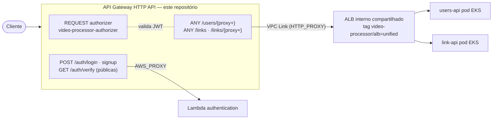

# iac-video-processor-gateway

Infraestrutura como código (Terraform) da **borda da plataforma** do Tech Challenge FIAP X (Fase 5 — Hackathon, 13SOAT): um **API Gateway HTTP API** (v2) que expõe as rotas públicas de autenticação (Lambda) e as rotas de domínio hospedadas no EKS (proxy via **VPC Link** para um ALB compartilhado), com um **REQUEST authorizer** plugado em toda rota protegida.

Repositório correspondente na organização: [`iac-video-processor-gateway`](https://github.com/13SOAT-andromeda/iac-video-processor-gateway).

---

## 1. Onde este repositório se encaixa na plataforma

Este é o repo de IaC da **borda** — ele não provisiona nenhum serviço de negócio, só o roteamento de entrada. A infraestrutura e os serviços vivem em repositórios separados:

| Repositório | Responsabilidade | Relação com este repo |
|---|---|---|
| [`iac-video-processor-infra`](https://github.com/13SOAT-andromeda/iac-video-processor-infra) | VPC, EKS, ECR, filas/tópicos SNS/SQS, bucket S3, Ingress centralizado | Provisiona a VPC (`video-processor-vpc`) e mantém o `Ingress` único cujo ALB (tag `video-processor/alb = unified`) este repo descobre e usa como alvo do VPC Link |
| [`iac-video-processor-data`](https://github.com/13SOAT-andromeda/iac-video-processor-data) | RDS (users) + DynamoDB (`auth-credentials`, `Links`, `LinkEvents`) | Sem acoplamento direto — os dados são acessados pelos serviços, nunca pelo gateway |
| `video-processor-authentication-api` | Login/signup/verify (Lambda) | Alvo das 3 rotas públicas `/auth/*` (integração `AWS_PROXY`, permissão resource-based via `aws_lambda_permission`) |
| `video-processor-authorizer` | Validação de JWT (Lambda) | Plugado como `REQUEST` authorizer em toda rota protegida |
| [`video-processor-users-api`](https://github.com/13SOAT-andromeda/video-processor-users-api) | API de usuários (pod EKS) | Recebe `ANY /users/{proxy+}` via VPC Link → ALB, com o path reescrito para `/api/users/...` |
| [`video-processor-link-api`](https://github.com/13SOAT-andromeda/video-processor-link-api) | Links de upload/download (pod EKS) | Recebe `ANY /links` e `ANY /links/{proxy+}` via VPC Link → ALB, com o path reescrito para `/api/links/...` |



**Princípio central:** o gateway só decide "isso é rota pública de auth (Lambda) ou rota de domínio (manda pro ALB)". O roteamento fino por verbo/recurso é responsabilidade do Gin dentro de cada serviço — por isso as rotas de domínio são **catch-all** (`{proxy+}`), não uma rota por verbo. A distinção dono-do-recurso vs. `administrator` também **não** acontece aqui: o authorizer só garante que existe um JWT válido; cada serviço revalida o JWT e aplica a autorização fina por conta própria (defesa em profundidade — ver README do `users-api`, §3).

---

## 2. Rotas

| Rota | Autorização | Integração | Destino |
|---|---|---|---|
| `POST /auth/login` | pública (`NONE`) | `AWS_PROXY` | Lambda `video-processor-authentication` |
| `POST /auth/signup` | pública (`NONE`, ADR-011/013) | `AWS_PROXY` | Lambda `video-processor-authentication` |
| `GET /auth/verify` | pública (`NONE`, ADR-011/013) | `AWS_PROXY` | Lambda `video-processor-authentication` |
| `ANY /users/{proxy+}` | `CUSTOM` (authorizer) | `HTTP_PROXY` via VPC Link | ALB → `users-api`, path reescrito `/users/...` → `/api/users/...` |
| `ANY /links/{proxy+}` | `CUSTOM` (authorizer) | `HTTP_PROXY` via VPC Link | ALB → `link-api`, path reescrito `/links/...` → `/api/links/...` |
| `ANY /links` | `CUSTOM` (authorizer) | `HTTP_PROXY` via VPC Link | idem — rota própria porque `POST/GET /links` não têm segmento extra e o `{proxy+}` sozinho não os captura |

O rewrite de path usa `request_parameters = { "overwrite:path" = "/api$request.path" }`: a rota pública fica sem prefixo (`/users`, `/links` — o que o cliente chama) e o gateway reescreve para o prefixo `/api` que o Gin registra dentro dos pods.

As rotas públicas de `/auth/*` são públicas **por design**: quem faz signup ainda não tem JWT, e a verificação de e-mail acontece antes do primeiro login.

---

## 3. Authorizer (borda)

- Tipo `REQUEST` (não `TOKEN`) — payload format `2.0`, simple responses habilitadas, devolve `userId`/`role` no `context`.
- Fonte de identidade: header `Authorization` (`identity_sources`).
- Cache de resultado: `authorizer_result_ttl_in_seconds = 300`, chaveado pelo header `Authorization`.
- Lambda `video-processor-authorizer`, invocada via permissão resource-based (`aws_lambda_permission`, principal `apigateway.amazonaws.com`) — **nenhuma IAM role é criada ou referenciada neste repo** (decisão definitiva da spec, §6.1: integração Lambda é resource-based, access log de HTTP API não exige role de conta, e VPC Link usa só security group). Efeito prático no AWS Academy: zero exposição às restrições de `iam:CreateRole`/`iam:PassRole` da `LabRole`.

---

## 4. VPC Link + ALB compartilhado

- **1 VPC Link único** (`video-processor-vpc-link`), reaproveitado por todas as rotas de domínio atuais e futuras — não é 1 VPC Link por serviço.
- **Security group dedicado** (`aws_security_group.vpc_link`), egress liberado (`0.0.0.0/0`) — recurso próprio deste repo, não reaproveita o SG do cluster EKS.
- O **ALB não é criado por nenhum repo Terraform** — é provisionado dinamicamente pelo AWS Load Balancer Controller a partir do `Ingress` único mantido pelo `iac-video-processor-infra`. Este repo só o **descobre** via `data.aws_lb` pela tag exclusiva `video-processor/alb = unified` (tag genérica de cluster não serve: com mais de um Ingress/ALB o data source vira loteria — bug já vivido no tech-challenge anterior).
- ALB **interno** (`scheme: internal`): só alcançável pelo VPC Link — nunca exposto direto à internet. Listener na porta 80 (tráfego interno à VPC; TLS termina no API Gateway).
- **Custo de adicionar um serviço novo:** 1 rota nova aqui (ex.: `ANY /videos/{proxy+}` apontando pro mesmo ALB/VPC Link) + 1 regra de path no Ingress centralizado do `infra`. Nenhum VPC Link, ALB ou security group novo — 1 Load Balancer para N serviços.

---

## 5. Acoplamento cross-repo ([`prod/data.tf`](prod/data.tf))

Este repo **não recebe ARNs por variável** — descobre tudo por data source, o que torna os nomes/tags abaixo contratos entre repositórios:

| Data source | Contrato | Definido em |
|---|---|---|
| `aws_lambda_function.authentication` | nome exato `video-processor-authentication` | Terraform do `authentication-api` |
| `aws_lambda_function.authorizer` | nome exato `video-processor-authorizer` | Terraform do `authorizer` |
| `aws_vpc.selected` | tag `Name = video-processor-vpc` | `iac-video-processor-infra` |
| `aws_subnets.private` | subnets da VPC com tag `Name = *-private-*` | `iac-video-processor-infra` |
| `aws_lb.eks_alb` | tag `video-processor/alb = unified` (via annotation do Ingress) | `iac-video-processor-infra` |
| `aws_lb_listener.eks_alb_listener` | listener porta 80 do ALB acima | AWS Load Balancer Controller |

Consequência prática: o `terraform apply` deste repo **exige que `iac-video-processor-infra` e as duas Lambdas já estejam aplicados** — os data sources falham se os recursos não existirem.

---

## 6. Estrutura de pastas

```
dev/                     LocalStack (tflocal) — provider apontando pra localhost:4566,
                         ALB mockado por ARN fixo (LocalStack Community não tem o fluxo
                         Ingress→ALB real)
prod/                    AWS real — backend S3 (key video-processor-gateway/terraform.tfstate)
prod/tests/              testes de plano (terraform test, providers mockados)
docs/superpowers/specs   spec de design (decisões de rota, VPC Link, tag do ALB, LabRole)
docs/superpowers/plans   planos de implementação
```

`dev/` e `prod/` são raízes Terraform independentes com o mesmo módulo e as mesmas rotas — o `dev` troca os data sources de Lambda/VPC por equivalentes LocalStack e mocka o listener do ALB.

Módulo principal: [`terraform-aws-modules/apigateway-v2/aws`](https://registry.terraform.io/modules/terraform-aws-modules/apigateway-v2/aws/latest) `~> 6.1` (HTTP API, suporta `vpc_links` nativamente), provider `hashicorp/aws ~> 6.54`, Terraform `>= 1.7.0`.

---

## 7. Rodando localmente (LocalStack)

### Pré-requisitos

- Terraform 1.7+
- [LocalStack](https://localstack.cloud/) rodando em `localhost:4566` (com o bucket de state `video-processor-bucket-andromeda-local` criado)
- [`tflocal`](https://github.com/localstack/terraform-local) (opcional — o provider do `dev/` já aponta os endpoints manualmente)

### Passo a passo

```bash
cd dev
terraform init
terraform plan
terraform apply
```

> As Lambdas `video-processor-authentication`/`video-processor-authorizer` precisam existir no LocalStack antes do apply (data sources). O ALB é mockado por um ARN fixo (`locals.eks_alb_listener_arn`) porque o LocalStack Community não materializa o fluxo Ingress→ALB do EKS.

---

## 8. Deploy em produção

```bash
cd prod
terraform init -backend-config="bucket=<bucket-de-state>"
terraform plan
terraform apply
```

Variáveis ([`prod/variables.tf`](prod/variables.tf)): `environment` (padrão `prod`) e `region` (padrão `us-east-1`) — todo o resto é descoberto por data source (§5).

Output: `api_endpoint` — a URL pública do HTTP API (não há domínio customizado nesta fase, `create_domain_name = false`).

**Ordem de aplicação entre repos:** `iac-video-processor-infra` (VPC + EKS + Ingress/ALB) e os repos das Lambdas (`authentication`, `authorizer`) **antes** deste. Os serviços de EKS (`users-api`, `link-api`) podem subir depois — o gateway roteia pro ALB independentemente de os pods estarem no ar.

---

## 9. Testes

```bash
cd prod
terraform test
```

[`prod/tests/gateway_unit_test.tftest.hcl`](prod/tests/gateway_unit_test.tftest.hcl) roda contra `plan` com **providers mockados** (sem AWS real), garantindo os invariantes da borda:

- as 3 rotas `/auth/*` existem e permanecem **públicas** (`authorization_type = NONE`) — plugar o authorizer nelas quebraria login/signup/verify;
- `ANY /users/{proxy+}`, `ANY /links` e `ANY /links/{proxy+}` existem e permanecem atrás do authorizer (`CUSTOM`);
- o rewrite `overwrite:path = /api$request.path` das rotas `/links` está presente;
- exatamente **1 VPC Link** compartilhado;
- security group do VPC Link com egress liberado;
- permissões de invoke das Lambdas concedidas ao principal `apigateway.amazonaws.com`.
